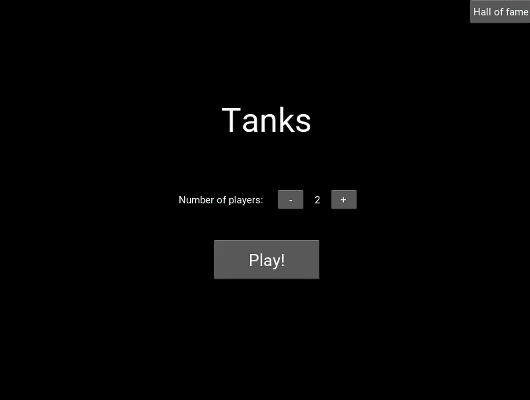

# Mff_Python_School_Project
- Tanks game - school project in Python and Kivy\
- Features local multiplayer on one PC\
- Video: https://youtu.be/XKkhcg5h9VI

## How to install and run project
1. Clone the repository 
2. Create virtual enviroment
3. Install packages using Pipenv
4. Run tanks/TanksApp.py
